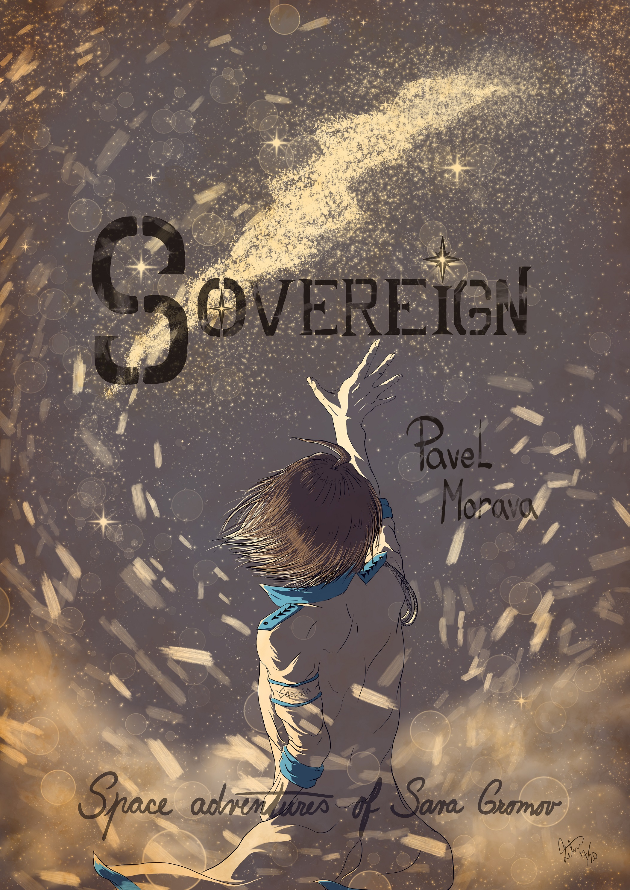
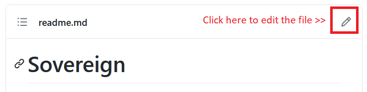

# Sovereign

## Space adventures of Sava Gromov

**The sci-fi novel by Pavel Morava**

* Is it possible to become a supreme being?
* Is human race that indispensable as people do believe?
* If we cannot have gods anymore, do we need demons?
* Are imperfect copies of human beings the way how to achieve immortality?

Sovereign is a modern sci-fi novel, more fictional than scientific, addressing contemporary issues of our world. The main character bears no resemblance to a millennial, though.

A cynical and rational to the bone, Captain Sava Gromov becomes the ultimate enemy of the Advanced Nations. Never really fond of human race, he decides to play the role of a villain to the bitter end, fulfilling so the grand scheme of the mysterious Emperor in the Mask.

Follow him on his adventurous journey. Understand why demons have to reappear again.

# Story

After his involuntary departure from Space Forces, in which he spent twenty years of life, Captain Sava Gromov desires an extra reason for his existence.

With a vague idea of becoming a merchant, he buys a secondhand spacecraft, loads the cargo, and leaves for an adventurous journey through the Solar system.

On his way, he receives an SOS coming from an immobile research spaceship. To rescue the crew in a crisis is the easier part; the harder part comes afterward. The research team discovered an abandoned weapon, originating from a forgotten empire.

Unfortunately, not everyone considers the vanished empire harmless. There is an organization actively searching and destroying its remnants.

Only two choices remain for Gromov: either to die or operate the unknown weapon in a slight hope that the archaic device may deter his pursuers. Choosing the latter, Gromov assimilates with inhuman digital being into the ultimate symbiosis of the organic and digital world.

The Universe turns out to be a dangerous place: full of conflicts, threatening aliens, and unpredictable twists. The unmanageable chaos dwells in desperate need of a unifying force.

Will Gromov become the Sovereign of the Solar system?

# Author

Born in the Czech Republic, Pavel Morava is a non-native English speaker. When he was twenty-two years old, he published his first book that did not become an international bestseller.

After a few other attempts, Pavel Morava abandoned the literary career for over twenty years, during which period he has been focusing on working in plastics industry, programming, and raising of children.

Recently, with more time at his disposal, he returned to the forgotten ambition, fighting a futile battle with English language, procrastination, and the tendency to give up too early.

Being vivid reader of not Anglo-Saxon origin, Pavel Morava was fortunate enough to experience books from different countries, including Czech, Russian, Polish,  Chinese, Swedish, Dutch, Japanese, French, German, and English.  

Such a vast literary variety heavily influenced his own work, which typically relies on an one-point-of-view narrative, consecutive storytelling, and elimination of unnecessary details.

Web novels and online publishing made him reevaluate his approach to style and building blocks of the text; the result should be, hopefully, lighter, shorter, and more intelligible for reading on electronic devices.

# Where to read?

The most recent updates and the work in progress is located in this repository.

If you prefer reading on dedicated platforms, you can find the story on:

* [Royal Road](https://www.royalroad.com/fiction/26615/sovereign)

# How to contribute?

The proof-readers and beta-readers are more than welcome.

If you are familiar with Github and have an account there, you can suggest edits and improvements anytime.

The easiest way how to adjust a file is to click on the small pencil in the right upper corner.

You can also help to **share**, **rate**, and **review** the novel on your favorite social platform if you like it.

The words of encouragement are always appreciated!
